# Mapa Full Stack Completo com Exemplos de Código

## Cascata Vertical — JavaScript/ES6+

```mermaid
graph TD
    JS[JavaScript/ES6+] --> VAR[Variáveis e Tipos] --> FUNC[Funções] --> OBJ[Objetos e Arrays] --> ES6[Recursos ES6] --> PROM[Promises] --> ASYNC[Async/Await] --> MOD[Módulos] --> DOM[DOM] --> EVENT[Eventos] --> FETCH[Fetch API] --> TEST_JS[Testes JS]
```



<details>
<summary><strong>📚 Clique para ver exemplos JavaScript/ES6+</strong></summary>

### Exemplos JavaScript/ES6+

**1. Variáveis e Tipos**

```javascript
// Tipos primitivos
let nome = "João"; // string
const idade = 25; // number
let ativo = true; // boolean
let vazio = null; // null
let indefinido; // undefined

// Template literals
const apresentacao = `Olá, eu sou ${nome} e tenho ${idade} anos`;
```

**2. Funções**

```javascript
// Função tradicional
function somar(a, b) {
  return a + b;
}

// Arrow function
const multiplicar = (a, b) => a * b;

// Função com parâmetros padrão
const saudar = (nome = "Visitante") => `Olá, ${nome}!`;
```

**3. Objetos e Arrays**

```javascript
// Objeto com métodos
const pessoa = {
  nome: "Maria",
  idade: 30,
  apresentar() {
    return `Sou ${this.nome}, ${this.idade} anos`;
  },
};

// Array com métodos
const numeros = [1, 2, 3, 4, 5];
const pares = numeros.filter((n) => n % 2 === 0);
const dobrados = numeros.map((n) => n * 2);
```

**4. Recursos ES6**

```javascript
// Destructuring
const { nome, idade } = pessoa;
const [primeiro, segundo] = numeros;

// Spread operator
const novoArray = [...numeros, 6, 7, 8];
const novaPessoa = { ...pessoa, cidade: "São Paulo" };

// Classes
class Usuario {
  constructor(nome, email) {
    this.nome = nome;
    this.email = email;
  }

  login() {
    return `${this.nome} fez login`;
  }
}
```

**5. Promises e Async/Await**

```javascript
// Promise
const buscarDados = () => {
  return new Promise((resolve, reject) => {
    setTimeout(() => {
      resolve({ id: 1, nome: "Dados" });
    }, 1000);
  });
};

// Async/Await
const obterDados = async () => {
  try {
    const dados = await buscarDados();
    console.log(dados);
  } catch (error) {
    console.error("Erro:", error);
  }
};
```

**6. Módulos**

```javascript
// export (utils.js)
export const formatarData = (data) => {
  return data.toLocaleDateString("pt-BR");
};

export default class Calculadora {
  static somar(a, b) {
    return a + b;
  }
}

// import (main.js)
import Calculadora, { formatarData } from "./utils.js";
```

**7. DOM Manipulation**

```javascript
// Selecionar elementos
const botao = document.querySelector("#meuBotao");
const lista = document.querySelectorAll(".item");

// Manipular elementos
botao.addEventListener("click", () => {
  const novoItem = document.createElement("li");
  novoItem.textContent = "Novo item";
  document.querySelector("ul").appendChild(novoItem);
});

// Modificar classes e estilos
botao.classList.add("ativo");
botao.style.backgroundColor = "#007bff";
```

**8. Fetch API**

```javascript
// GET Request
const buscarUsuarios = async () => {
  try {
    const response = await fetch("/api/usuarios");
    const usuarios = await response.json();
    return usuarios;
  } catch (error) {
    console.error("Erro ao buscar usuários:", error);
  }
};

// POST Request
const criarUsuario = async (userData) => {
  const response = await fetch("/api/usuarios", {
    method: "POST",
    headers: {
      "Content-Type": "application/json",
    },
    body: JSON.stringify(userData),
  });
  return response.json();
};
```

</details>

## Cascata Vertical — React

```mermaid
graph TD
    REACT[React] --> COMP[Componentes] --> JSX[JSX] --> PROPS[Props e State] --> HOOKS[Hooks] --> CONTEXT[Context API] --> STATE[Gerenciamento de Estado] --> ROUTER[React Router] --> API[Integração com APIs] --> STYLE[Estilização] --> TEST_REACT[Testes React] --> DEPLOY_REACT[Deploy React]
```



<details>
<summary><strong>⚛️ Clique para ver exemplos React</strong></summary>

### Exemplos React

**1. Componentes Funcionais**

```jsx
// Componente simples
function Titulo({ texto, nivel = 1 }) {
  const Tag = `h${nivel}`;
  return <Tag className="titulo">{texto}</Tag>;
}

// Componente com children
function Card({ children, titulo }) {
  return (
    <div className="card">
      <h3>{titulo}</h3>
      <div className="card-content">{children}</div>
    </div>
  );
}
```

**2. JSX Avançado**

```jsx
function ListaProdutos({ produtos }) {
  return (
    <div className="produtos">
      {produtos.length > 0 ? (
        produtos.map((produto) => (
          <div
            key={produto.id}
            className={`produto ${produto.ativo ? "ativo" : "inativo"}`}
          >
            <h4>{produto.nome}</h4>
            <p>R$ {produto.preco.toFixed(2)}</p>
            {produto.desconto && (
              <span className="desconto">-{produto.desconto}%</span>
            )}
          </div>
        ))
      ) : (
        <p>Nenhum produto encontrado</p>
      )}
    </div>
  );
}
```

**3. Props e State**

```jsx
import { useState } from "react";

function Contador({ inicial = 0, step = 1 }) {
  const [count, setCount] = useState(inicial);

  const incrementar = () => setCount((prev) => prev + step);
  const decrementar = () => setCount((prev) => prev - step);
  const resetar = () => setCount(inicial);

  return (
    <div className="contador">
      <h2>Contador: {count}</h2>
      <button onClick={decrementar}>-{step}</button>
      <button onClick={resetar}>Reset</button>
      <button onClick={incrementar}>+{step}</button>
    </div>
  );
}
```

**4. Hooks Essenciais**

```jsx
import { useState, useEffect, useCallback, useMemo } from "react";

function BuscadorUsuarios() {
  const [usuarios, setUsuarios] = useState([]);
  const [loading, setLoading] = useState(false);
  const [filtro, setFiltro] = useState("");

  // useEffect para buscar dados
  useEffect(() => {
    const buscarUsuarios = async () => {
      setLoading(true);
      try {
        const response = await fetch("/api/usuarios");
        const data = await response.json();
        setUsuarios(data);
      } finally {
        setLoading(false);
      }
    };

    buscarUsuarios();
  }, []);

  // useCallback para evitar re-renders
  const filtrarUsuarios = useCallback((termo) => {
    setFiltro(termo);
  }, []);

  // useMemo para cálculos custosos
  const usuariosFiltrados = useMemo(() => {
    return usuarios.filter((user) =>
      user.nome.toLowerCase().includes(filtro.toLowerCase())
    );
  }, [usuarios, filtro]);

  if (loading) return <div>Carregando...</div>;

  return (
    <div>
      <input
        type="text"
        placeholder="Filtrar usuários..."
        onChange={(e) => filtrarUsuarios(e.target.value)}
      />
      <ul>
        {usuariosFiltrados.map((user) => (
          <li key={user.id}>{user.nome}</li>
        ))}
      </ul>
    </div>
  );
}
```

**5. Context API**

```jsx
import { createContext, useContext, useReducer } from "react";

// Criando o Context
const AuthContext = createContext();

// Reducer para gerenciar estado
const authReducer = (state, action) => {
  switch (action.type) {
    case "LOGIN":
      return { ...state, user: action.payload, isAuthenticated: true };
    case "LOGOUT":
      return { ...state, user: null, isAuthenticated: false };
    default:
      return state;
  }
};

// Provider
export function AuthProvider({ children }) {
  const [state, dispatch] = useReducer(authReducer, {
    user: null,
    isAuthenticated: false,
  });

  const login = (userData) => {
    dispatch({ type: "LOGIN", payload: userData });
  };

  const logout = () => {
    dispatch({ type: "LOGOUT" });
  };

  return (
    <AuthContext.Provider value={{ ...state, login, logout }}>
      {children}
    </AuthContext.Provider>
  );
}

// Hook customizado
export const useAuth = () => {
  const context = useContext(AuthContext);
  if (!context) {
    throw new Error("useAuth deve ser usado dentro de AuthProvider");
  }
  return context;
};
```

**6. React Router**

```jsx
import {
  BrowserRouter,
  Routes,
  Route,
  Navigate,
  useParams,
} from "react-router-dom";

function App() {
  return (
    <BrowserRouter>
      <Routes>
        <Route path="/" element={<Home />} />
        <Route path="/usuarios" element={<Usuarios />} />
        <Route path="/usuario/:id" element={<PerfilUsuario />} />
        <Route
          path="/admin"
          element={
            <ProtectedRoute>
              <Admin />
            </ProtectedRoute>
          }
        />
        <Route path="*" element={<Navigate to="/" replace />} />
      </Routes>
    </BrowserRouter>
  );
}

function PerfilUsuario() {
  const { id } = useParams();
  return <div>Perfil do usuário {id}</div>;
}

function ProtectedRoute({ children }) {
  const { isAuthenticated } = useAuth();
  return isAuthenticated ? children : <Navigate to="/login" />;
}
```

**7. Custom Hooks**

```jsx
// Hook para gerenciar formulários
function useForm(initialValues) {
  const [values, setValues] = useState(initialValues);
  const [errors, setErrors] = useState({});

  const handleChange = (e) => {
    const { name, value } = e.target;
    setValues((prev) => ({ ...prev, [name]: value }));

    // Limpar erro quando o usuário digita
    if (errors[name]) {
      setErrors((prev) => ({ ...prev, [name]: "" }));
    }
  };

  const validate = (validationRules) => {
    const newErrors = {};

    Object.keys(validationRules).forEach((field) => {
      const rule = validationRules[field];
      if (rule.required && !values[field]) {
        newErrors[field] = "Campo obrigatório";
      }
    });

    setErrors(newErrors);
    return Object.keys(newErrors).length === 0;
  };

  return { values, errors, handleChange, validate, setValues };
}

// Usando o hook
function FormularioUsuario() {
  const { values, errors, handleChange, validate } = useForm({
    nome: "",
    email: "",
  });

  const handleSubmit = (e) => {
    e.preventDefault();
    if (validate({ nome: { required: true }, email: { required: true } })) {
      console.log("Formulário válido:", values);
    }
  };

  return (
    <form onSubmit={handleSubmit}>
      <input
        name="nome"
        value={values.nome}
        onChange={handleChange}
        placeholder="Nome"
      />
      {errors.nome && <span className="error">{errors.nome}</span>}

      <input
        name="email"
        value={values.email}
        onChange={handleChange}
        placeholder="Email"
      />
      {errors.email && <span className="error">{errors.email}</span>}

      <button type="submit">Enviar</button>
    </form>
  );
}
```

</details>

## Cascata Vertical — Next.js

```mermaid
graph TD
    NEXT[Next.js] --> ESTRUT[Estrutura] --> ROTAS[Rotas] --> SSR[SSR/SSG] --> DATA[Data Fetching] --> API_ROUTES[API Routes] --> AUTH[Autenticação] --> MIDDLE[Middlewares] --> OTIM[Otimização] --> SEO[SEO] --> DEPLOY_NEXT[Deploy Next.js]
```



<details>
<summary><strong>⚡ Clique para ver exemplos Next.js</strong></summary>

### Exemplos Next.js

**1. Estrutura de Páginas**

```jsx
// pages/index.js - Home page
export default function Home({ posts }) {
    return (
        <div>
            <h1>Meu Blog</h1>
            {posts.map(post => (
                <article key={post.id}>
                    <h2>{post.titulo}</h2>
                    <p>{post.resumo}</p>
                </article>
            ))}
        </div>
    );
}

// pages/blog/[slug].js - Rota dinâmica
import { useRouter } from 'next/router';

export default function Post({ post }) {
    const router = useRouter();

    if (router.isFallback) {
        return <div>Carregando...</div>;
    }

    return (
        <article>
            <h1>{post.titulo}</h1>
            <div dangerouslySetInnerHTML={{ __html: post.conteudo }} />
        </article>
    );
}
```

**2. SSR e SSG**

```jsx
// Static Site Generation (SSG)
export async function getStaticProps() {
  const res = await fetch("https://api.exemplo.com/posts");
  const posts = await res.json();

  return {
    props: { posts },
    revalidate: 60, // ISR - regenera a cada 60 segundos
  };
}

// Para rotas dinâmicas
export async function getStaticPaths() {
  const res = await fetch("https://api.exemplo.com/posts");
  const posts = await res.json();

  const paths = posts.map((post) => ({
    params: { slug: post.slug },
  }));

  return {
    paths,
    fallback: "blocking", // ou true, false
  };
}

// Server-Side Rendering (SSR)
export async function getServerSideProps(context) {
  const { slug } = context.params;
  const res = await fetch(`https://api.exemplo.com/posts/${slug}`);
  const post = await res.json();

  if (!post) {
    return { notFound: true };
  }

  return {
    props: { post },
  };
}
```

**3. API Routes**

```jsx
// pages/api/users/[id].js
export default async function handler(req, res) {
    const { id } = req.query;

    switch (req.method) {
        case 'GET':
            try {
                const user = await getUserById(id);
                res.status(200).json(user);
            } catch (error) {
                res.status(404).json({ error: 'Usuário não encontrado' });
            }
            break;

        case 'PUT':
            try {
                const updatedUser = await updateUser(id, req.body);
                res.status(200).json(updatedUser);
            } catch (error) {
                res.status(400).json({ error: 'Erro ao atualizar usuário' });
            }
            break;

        case 'DELETE':
            try {
                await deleteUser(id);
                res.status(204).end();
            } catch (error) {
                res.status(400).json({ error: 'Erro ao deletar usuário' });
            }
            break;

        default:
            res.setHeader('Allow', ['GET', 'PUT', 'DELETE']);
            res.status(405).end(`Method ${req.method} Not Allowed`);
    }
}

// pages/api/auth/login.js
import jwt from 'jsonwebtoken';
import bcrypt from 'bcryptjs';

export default async function handler(req, res) {
    if (req.method !== 'POST') {
        return res.status(405).json({ error: 'Método não permitido' });
    }

    const { email, password } = req.body;

    try {
        const user = await findUserByEmail(email);

        if (!user || !await bcrypt.compare(password, user.password)) {
            return res.status(401).json({ error: 'Credenciais inválidas' });
        }

        const token = jwt.sign(
            { userId: user.id, email: user.email },
            process.env.JWT_SECRET,
            { expiresIn: '7d' }
        );

        res.status(200).json({ token, user: { id: user.id, email: user.email } });
    } catch (error) {
        res.status(500).json({ error: 'Erro interno do servidor' });
    }
}
```

**4. Middleware**

```jsx
// middleware.js
import { NextResponse } from "next/server";
import jwt from "jsonwebtoken";

export function middleware(request) {
  // Verificar autenticação para rotas protegidas
  if (request.nextUrl.pathname.startsWith("/admin")) {
    const token = request.cookies.get("auth-token")?.value;

    if (!token) {
      return NextResponse.redirect(new URL("/login", request.url));
    }

    try {
      jwt.verify(token, process.env.JWT_SECRET);
    } catch {
      return NextResponse.redirect(new URL("/login", request.url));
    }
  }

  // Adicionar headers de segurança
  const response = NextResponse.next();
  response.headers.set("X-Frame-Options", "DENY");
  response.headers.set("X-Content-Type-Options", "nosniff");

  return response;
}

export const config = {
  matcher: ["/admin/:path*", "/api/protected/:path*"],
};
```

**5. Otimização de Imagens**

```jsx
import Image from "next/image";
import Link from "next/link";

function ProductCard({ produto }) {
  return (
    <div className="product-card">
      <Link href={`/produtos/${produto.slug}`}>
        <Image
          src={produto.imagem}
          alt={produto.nome}
          width={300}
          height={200}
          priority={produto.featured} // Para imagens above-the-fold
          placeholder="blur"
          blurDataURL="data:image/jpeg;base64,..." // Placeholder blur
        />
      </Link>
      <h3>{produto.nome}</h3>
      <p>R$ {produto.preco}</p>
    </div>
  );
}
```

**6. SEO com Next.js**

```jsx
import Head from "next/head";

function BlogPost({ post }) {
  const structuredData = {
    "@context": "https://schema.org",
    "@type": "BlogPosting",
    headline: post.titulo,
    author: {
      "@type": "Person",
      name: post.autor,
    },
    datePublished: post.dataPublicacao,
  };

  return (
    <>
      <Head>
        <title>{post.titulo} | Meu Blog</title>
        <meta name="description" content={post.resumo} />
        <meta property="og:title" content={post.titulo} />
        <meta property="og:description" content={post.resumo} />
        <meta property="og:image" content={post.imagemDestaque} />
        <meta property="og:type" content="article" />
        <meta name="twitter:card" content="summary_large_image" />
        <link rel="canonical" href={`https://meublog.com/blog/${post.slug}`} />
        <script
          type="application/ld+json"
          dangerouslySetInnerHTML={{ __html: JSON.stringify(structuredData) }}
        />
      </Head>
      <article>
        <h1>{post.titulo}</h1>
        <div dangerouslySetInnerHTML={{ __html: post.conteudo }} />
      </article>
    </>
  );
}
```

**7. Configuração Avançada**

```javascript
// next.config.js
/** @type {import('next').NextConfig} */
const nextConfig = {
  reactStrictMode: true,
  swcMinify: true,

  // Configurações de imagem
  images: {
    domains: ["exemplo.com", "cdn.exemplo.com"],
    deviceSizes: [640, 750, 828, 1080, 1200, 1920, 2048, 3840],
    imageSizes: [16, 32, 48, 64, 96, 128, 256, 384],
  },

  // Headers personalizados
  async headers() {
    return [
      {
        source: "/api/:path*",
        headers: [
          { key: "Access-Control-Allow-Origin", value: "*" },
          { key: "Access-Control-Allow-Methods", value: "GET,POST,PUT,DELETE" },
        ],
      },
    ];
  },

  // Redirects
  async redirects() {
    return [
      {
        source: "/old-blog/:slug",
        destination: "/blog/:slug",
        permanent: true,
      },
    ];
  },

  // Variables de ambiente
  env: {
    CUSTOM_KEY: process.env.CUSTOM_KEY,
  },
};

module.exports = nextConfig;
```

</details>

## Cascata Vertical — PHP/Laravel

```mermaid
graph TD
    PHP[PHP] --> BASICO[Sintaxe Básica] --> FUNCOES[Funções] --> ARRAYS[Arrays] --> POO[POO] --> NAMESPACE[Namespaces] --> COMPOSER[Composer] --> LARAVEL[Laravel] --> ELOQUENT[Eloquent ORM] --> API_PHP[APIs] --> SEGURANCA[Segurança] --> TESTES[Testes] --> DEPLOY_PHP[Deploy PHP]
```



<details>
<summary><strong>🐘 Clique para ver exemplos PHP/Laravel</strong></summary>

### Exemplos PHP/Laravel

**1. Sintaxe Básica PHP**

```php
<?php
// Variáveis e tipos
$nome = "João";
$idade = 25;
$ativo = true;
$salario = 5000.50;

// Arrays
$frutas = ["maçã", "banana", "laranja"];
$pessoa = [
    "nome" => "Maria",
    "idade" => 30,
    "cidade" => "São Paulo"
];

// Operadores e estruturas condicionais
if ($idade >= 18) {
    echo "Maior de idade";
} elseif ($idade >= 16) {
    echo "Pode votar";
} else {
    echo "Menor de idade";
}

// Loops
foreach ($frutas as $fruta) {
    echo "Fruta: $fruta\n";
}

for ($i = 0; $i < count($frutas); $i++) {
    echo "Posição $i: {$frutas[$i]}\n";
}
?>
```

**2. Funções e POO**

```php
<?php
// Funções
function calcularIdade($nascimento) {
    return date('Y') - $nascimento;
}

function saudar($nome, $sobrenome = "") {
    return "Olá, $nome $sobrenome!";
}

// Arrow functions (PHP 7.4+)
$multiplicar = fn($a, $b) => $a * $b;

// Classes e POO
class Usuario {
    private $nome;
    private $email;
    private $senha;

    public function __construct($nome, $email) {
        $this->nome = $nome;
        $this->email = $email;
    }

    public function getNome() {
        return $this->nome;
    }

    public function setNome($nome) {
        $this->nome = $nome;
        return $this; // Para method chaining
    }

    public function autenticar($senha) {
        return password_verify($senha, $this->senha);
    }

    public function setSenha($senha) {
        $this->senha = password_hash($senha, PASSWORD_BCRYPT);
    }
}

// Herança
class Administrador extends Usuario {
    private $permissoes = [];

    public function adicionarPermissao($permissao) {
        $this->permissoes[] = $permissao;
    }

    public function temPermissao($permissao) {
        return in_array($permissao, $this->permissoes);
    }
}
?>
```

**3. Laravel - Estrutura Básica**

```php
// routes/web.php
Route::get('/', function () {
    return view('welcome');
});

Route::get('/usuarios', [UsuarioController::class, 'index']);
Route::post('/usuarios', [UsuarioController::class, 'store']);
Route::get('/usuarios/{id}', [UsuarioController::class, 'show']);
Route::put('/usuarios/{id}', [UsuarioController::class, 'update']);
Route::delete('/usuarios/{id}', [UsuarioController::class, 'destroy']);

// Ou usando resource routes
Route::resource('usuarios', UsuarioController::class);

// app/Http/Controllers/UsuarioController.php
<?php

namespace App\Http\Controllers;

use App\Models\Usuario;
use Illuminate\Http\Request;

class UsuarioController extends Controller
{
    public function index()
    {
        $usuarios = Usuario::paginate(10);
        return view('usuarios.index', compact('usuarios'));
    }

    public function store(Request $request)
    {
        $validated = $request->validate([
            'nome' => 'required|string|max:255',
            'email' => 'required|email|unique:usuarios',
            'senha' => 'required|min:8|confirmed'
        ]);

        $usuario = Usuario::create([
            'nome' => $validated['nome'],
            'email' => $validated['email'],
            'password' => bcrypt($validated['senha'])
        ]);

        return redirect()->route('usuarios.index')
                         ->with('success', 'Usuário criado com sucesso!');
    }

    public function show($id)
    {
        $usuario = Usuario::findOrFail($id);
        return view('usuarios.show', compact('usuario'));
    }

    public function update(Request $request, $id)
    {
        $usuario = Usuario::findOrFail($id);

        $validated = $request->validate([
            'nome' => 'required|string|max:255',
            'email' => 'required|email|unique:usuarios,email,' . $id
        ]);

        $usuario->update($validated);

        return redirect()->route('usuarios.show', $id)
                         ->with('success', 'Usuário atualizado!');
    }
}
```

**4. Eloquent ORM**

```php
// app/Models/Usuario.php
<?php

namespace App\Models;

use Illuminate\Database\Eloquent\Factories\HasFactory;
use Illuminate\Database\Eloquent\Model;
use Illuminate\Database\Eloquent\SoftDeletes;

class Usuario extends Model
{
    use HasFactory, SoftDeletes;

    protected $fillable = ['nome', 'email', 'password'];

    protected $hidden = ['password', 'remember_token'];

    protected $casts = [
        'email_verified_at' => 'datetime',
    ];

    // Relacionamentos
    public function posts()
    {
        return $this->hasMany(Post::class);
    }

    public function perfil()
    {
        return $this->hasOne(Perfil::class);
    }

    public function tags()
    {
        return $this->belongsToMany(Tag::class);
    }

    // Mutators e Accessors
    public function setPasswordAttribute($value)
    {
        $this->attributes['password'] = bcrypt($value);
    }

    public function getNomeCompletoAttribute()
    {
        return $this->nome . ' ' . $this->sobrenome;
    }

    // Scopes
    public function scopeAtivos($query)
    {
        return $query->where('ativo', true);
    }

    public function scopePorEmail($query, $email)
    {
        return $query->where('email', $email);
    }
}

// Usando o modelo
$usuarios = Usuario::ativos()->get();
$usuario = Usuario::porEmail('joao@email.com')->first();
$usuariosComPosts = Usuario::with('posts')->paginate(10);
```

**5. APIs em Laravel**

```php
// routes/api.php
Route::apiResource('usuarios', Api\UsuarioController::class);
Route::post('/login', [Api\AuthController::class, 'login']);
Route::middleware('auth:sanctum')->group(function () {
    Route::post('/logout', [Api\AuthController::class, 'logout']);
    Route::get('/me', [Api\AuthController::class, 'me']);
});

// app/Http/Controllers/Api/UsuarioController.php
<?php

namespace App\Http\Controllers\Api;

use App\Http\Controllers\Controller;
use App\Http\Resources\UsuarioResource;
use App\Models\Usuario;
use Illuminate\Http\Request;

class UsuarioController extends Controller
{
    public function index()
    {
        $usuarios = Usuario::paginate(10);
        return UsuarioResource::collection($usuarios);
    }

    public function store(Request $request)
    {
        $validated = $request->validate([
            'nome' => 'required|string|max:255',
            'email' => 'required|email|unique:usuarios',
            'password' => 'required|min:8'
        ]);

        $usuario = Usuario::create($validated);

        return new UsuarioResource($usuario);
    }

    public function show(Usuario $usuario)
    {
        return new UsuarioResource($usuario);
    }
}

// app/Http/Resources/UsuarioResource.php
<?php

namespace App\Http\Resources;

use Illuminate\Http\Resources\Json\JsonResource;

class UsuarioResource extends JsonResource
{
    public function toArray($request)
    {
        return [
            'id' => $this->id,
            'nome' => $this->nome,
            'email' => $this->email,
            'created_at' => $this->created_at->format('d/m/Y'),
            'posts_count' => $this->when($this->posts, $this->posts->count()),
        ];
    }
}
```

**6. Middlewares e Segurança**

```php
// app/Http/Middleware/CheckAge.php
<?php

namespace App\Http\Middleware;

use Closure;

class CheckAge
{
    public function handle($request, Closure $next, $age = 18)
    {
        if ($request->user()->idade < $age) {
            return redirect('home')->with('error', 'Acesso negado');
        }

        return $next($request);
    }
}

// Registrar no Kernel.php
protected $routeMiddleware = [
    'check.age' => \App\Http\Middleware\CheckAge::class,
];

// Usar nas rotas
Route::get('/admin', function () {
    return view('admin');
})->middleware('check.age:21');

// Validação de formulários
class StoreUsuarioRequest extends FormRequest
{
    public function authorize()
    {
        return auth()->check();
    }

    public function rules()
    {
        return [
            'nome' => 'required|string|max:255',
            'email' => 'required|email|unique:usuarios',
            'cpf' => 'required|cpf', // Custom rule
            'senha' => 'required|min:8|confirmed|regex:/^(?=.*[a-z])(?=.*[A-Z])(?=.*\d)/'
        ];
    }

    public function messages()
    {
        return [
            'senha.regex' => 'A senha deve conter ao menos uma letra maiúscula, minúscula e um número'
        ];
    }
}
```

**7. Testes em Laravel**

```php
// tests/Feature/UsuarioTest.php
<?php

namespace Tests\Feature;

use App\Models\Usuario;
use Illuminate\Foundation\Testing\RefreshDatabase;
use Tests\TestCase;

class UsuarioTest extends TestCase
{
    use RefreshDatabase;

    public function test_pode_criar_usuario()
    {
        $dadosUsuario = [
            'nome' => 'João Silva',
            'email' => 'joao@email.com',
            'password' => 'senha123',
            'password_confirmation' => 'senha123'
        ];

        $response = $this->post('/usuarios', $dadosUsuario);

        $response->assertRedirect('/usuarios');
        $this->assertDatabaseHas('usuarios', [
            'nome' => 'João Silva',
            'email' => 'joao@email.com'
        ]);
    }

    public function test_usuario_pode_fazer_login()
    {
        $usuario = Usuario::factory()->create([
            'email' => 'test@email.com',
            'password' => bcrypt('password')
        ]);

        $response = $this->post('/login', [
            'email' => 'test@email.com',
            'password' => 'password'
        ]);

        $response->assertRedirect('/dashboard');
        $this->assertAuthenticatedAs($usuario);
    }
}

// tests/Unit/UsuarioUnitTest.php
class UsuarioUnitTest extends TestCase
{
    public function test_usuario_tem_nome_completo()
    {
        $usuario = new Usuario();
        $usuario->nome = 'João';
        $usuario->sobrenome = 'Silva';

        $this->assertEquals('João Silva', $usuario->nome_completo);
    }
}
```

</details>

## Cascata Vertical — Python/Django

```mermaid
graph TD
    PYTHON[Python] --> SINTAXE[Sintaxe Básica] --> FUNC_PY[Funções] --> ESTRUT[Estruturas de Dados] --> OOP_PY[POO] --> VENV[Ambientes Virtuais] --> DJANGO[Django] --> MODELS[Models] --> VIEWS[Views] --> URLS[URLs] --> TEMPLATES[Templates] --> DRF[Django REST] --> TEST_PY[Testes Python] --> DEPLOY_PY[Deploy Python]
```



<details>
<summary><strong>🐍 Clique para ver exemplos Python/Django</strong></summary>

### Exemplos Python/Django

**1. Sintaxe Básica Python**

```python
# Variáveis e tipos
nome = "João"
idade = 25
ativo = True
salario = 5000.50

# Listas e dicionários
frutas = ["maçã", "banana", "laranja"]
pessoa = {
    "nome": "Maria",
    "idade": 30,
    "cidade": "São Paulo"
}

# Estruturas condicionais
if idade >= 18:
    print("Maior de idade")
elif idade >= 16:
    print("Pode votar")
else:
    print("Menor de idade")

# Loops
for fruta in frutas:
    print(f"Fruta: {fruta}")

# List comprehension
numeros_pares = [x for x in range(10) if x % 2 == 0]
quadrados = [x**2 for x in range(5)]

# Funções
def calcular_idade(nascimento):
    from datetime import date
    return date.today().year - nascimento

def saudar(nome, sobrenome=""):
    return f"Olá, {nome} {sobrenome}!"

# Lambda functions
multiplicar = lambda a, b: a * b
```

**2. POO em Python**

```python
class Usuario:
    def __init__(self, nome, email):
        self.nome = nome
        self.email = email
        self._senha = None  # Atributo protegido

    @property
    def nome_completo(self):
        return f"{self.nome}"

    @property
    def senha(self):
        return self._senha

    @senha.setter
    def senha(self, valor):
        import hashlib
        self._senha = hashlib.sha256(valor.encode()).hexdigest()

    def autenticar(self, senha):
        import hashlib
        senha_hash = hashlib.sha256(senha.encode()).hexdigest()
        return self._senha == senha_hash

    def __str__(self):
        return f"Usuario: {self.nome} - {self.email}"

# Herança
class Administrador(Usuario):
    def __init__(self, nome, email, permissoes=None):
        super().__init__(nome, email)
        self.permissoes = permissoes or []

    def adicionar_permissao(self, permissao):
        if permissao not in self.permissoes:
            self.permissoes.append(permissao)

    def tem_permissao(self, permissao):
        return permissao in self.permissoes

# Context manager
class GerenciadorBanco:
    def __enter__(self):
        print("Conectando ao banco...")
        return self

    def __exit__(self, exc_type, exc_val, exc_tb):
        print("Fechando conexão...")
        return False

# Decoradores
def log_execucao(func):
    def wrapper(*args, **kwargs):
        print(f"Executando {func.__name__}")
        resultado = func(*args, **kwargs)
        print(f"Finalizada {func.__name__}")
        return resultado
    return wrapper

@log_execucao
def operacao_importante():
    return "Operação concluída"
```

**3. Django - Models**

```python
# models.py
from django.db import models
from django.contrib.auth.models import User
from django.urls import reverse

class Categoria(models.Model):
    nome = models.CharField(max_length=100, unique=True)
    slug = models.SlugField(unique=True)
    descricao = models.TextField(blank=True)
    ativa = models.BooleanField(default=True)

    class Meta:
        verbose_name_plural = "Categorias"
        ordering = ['nome']

    def __str__(self):
        return self.nome

    def get_absolute_url(self):
        return reverse('categoria_detail', kwargs={'slug': self.slug})

class Post(models.Model):
    STATUS_CHOICES = [
        ('draft', 'Rascunho'),
        ('published', 'Publicado'),
        ('archived', 'Arquivado'),
    ]

    titulo = models.CharField(max_length=200)
    slug = models.SlugField(unique=True)
    autor = models.ForeignKey(User, on_delete=models.CASCADE, related_name='posts')
    categoria = models.ForeignKey(Categoria, on_delete=models.CASCADE)
    conteudo = models.TextField()
    status = models.CharField(max_length=10, choices=STATUS_CHOICES, default='draft')
    created_at = models.DateTimeField(auto_now_add=True)
    updated_at = models.DateTimeField(auto_now=True)
    tags = models.ManyToManyField('Tag', blank=True)

    class Meta:
        ordering = ['-created_at']
        indexes = [
            models.Index(fields=['status', 'created_at']),
        ]

    def __str__(self):
        return self.titulo

    @property
    def is_published(self):
        return self.status == 'published'

    def get_absolute_url(self):
        return reverse('post_detail', kwargs={'slug': self.slug})

class Tag(models.Model):
    nome = models.CharField(max_length=50, unique=True)

    def __str__(self):
        return self.nome
```

**4. Django - Views**

```python
# views.py
from django.shortcuts import render, get_object_or_404, redirect
from django.views.generic import ListView, DetailView, CreateView
from django.contrib.auth.decorators import login_required
from django.contrib.auth.mixins import LoginRequiredMixin
from django.http import JsonResponse
from django.core.paginator import Paginator
from .models import Post, Categoria
from .forms import PostForm

# Function-based views
def lista_posts(request):
    posts = Post.objects.filter(status='published').select_related('autor', 'categoria')

    # Paginação
    paginator = Paginator(posts, 10)
    page = request.GET.get('page')
    posts_paginados = paginator.get_page(page)

    context = {
        'posts': posts_paginados,
        'categorias': Categoria.objects.filter(ativa=True)
    }
    return render(request, 'blog/lista_posts.html', context)

def detalhe_post(request, slug):
    post = get_object_or_404(Post, slug=slug, status='published')
    posts_relacionados = Post.objects.filter(
        categoria=post.categoria,
        status='published'
    ).exclude(id=post.id)[:3]

    return render(request, 'blog/detalhe_post.html', {
        'post': post,
        'posts_relacionados': posts_relacionados
    })

@login_required
def criar_post(request):
    if request.method == 'POST':
        form = PostForm(request.POST)
        if form.is_valid():
            post = form.save(commit=False)
            post.autor = request.user
            post.save()
            form.save_m2m()  # Para ManyToMany
            return redirect('post_detail', slug=post.slug)
    else:
        form = PostForm()

    return render(request, 'blog/criar_post.html', {'form': form})

# Class-based views
class PostListView(ListView):
    model = Post
    template_name = 'blog/lista_posts.html'
    context_object_name = 'posts'
    paginate_by = 10

    def get_queryset(self):
        return Post.objects.filter(status='published').select_related('autor', 'categoria')

    def get_context_data(self, **kwargs):
        context = super().get_context_data(**kwargs)
        context['categorias'] = Categoria.objects.filter(ativa=True)
        return context

class PostDetailView(DetailView):
    model = Post
    template_name = 'blog/detalhe_post.html'
    context_object_name = 'post'

    def get_queryset(self):
        return Post.objects.filter(status='published')

class CriarPostView(LoginRequiredMixin, CreateView):
    model = Post
    form_class = PostForm
    template_name = 'blog/criar_post.html'

    def form_valid(self, form):
        form.instance.autor = self.request.user
        return super().form_valid(form)

# API View (JSON)
def api_posts(request):
    posts = Post.objects.filter(status='published').values(
        'id', 'titulo', 'slug', 'created_at'
    )
    return JsonResponse(list(posts), safe=False)
```

**5. Django - URLs e Templates**

```python
# urls.py
from django.urls import path
from . import views

app_name = 'blog'

urlpatterns = [
    path('', views.PostListView.as_view(), name='post_list'),
    path('post/<slug:slug>/', views.PostDetailView.as_view(), name='post_detail'),
    path('categoria/<slug:slug>/', views.posts_por_categoria, name='posts_categoria'),
    path('criar/', views.CriarPostView.as_view(), name='criar_post'),
    path('api/posts/', views.api_posts, name='api_posts'),
]
```

```html
<!-- templates/blog/lista_posts.html -->
  Lista de Posts 
<div class="container">
  <h1>Blog Posts</h1>

  <div class="row">
    <div class="col-md-8">
      
      <article class="mb-4">
        <h2>
          <a href="">{{ post.titulo }}</a>
        </h2>
        <p class="text-muted">
          Por {{ post.autor.get_full_name|default:post.autor.username }} em {{
          post.created_at|date:"d/m/Y" }} | Categoria:
          <a href=""
            >{{ post.categoria.nome }}</a
          >
        </p>
        <p>{{ post.conteudo|truncatewords:30 }}</p>
        <a href="" class="btn btn-primary"
          >Ler mais</a
        >
      </article>
      <hr />
      
      <p>Nenhum post encontrado.</p>
      

      <!-- Paginação -->
      
      <nav>
        <ul class="pagination">
          
          <li class="page-item">
            <a
              class="page-link"
              href="?page={{ page_obj.previous_page_number }}"
              >Anterior</a
            >
          </li>
          

          <li class="page-item active">
            <span class="page-link"
              >{{ page_obj.number }} de {{ page_obj.paginator.num_pages }}</span
            >
          </li>

          
          <li class="page-item">
            <a class="page-link" href="?page={{ page_obj.next_page_number }}"
              >Próxima</a
            >
          </li>
          
        </ul>
      </nav>
      
    </div>

    <div class="col-md-4">
      <h3>Categorias</h3>
      <ul class="list-group">
        
        <li class="list-group-item">
          <a href=""
            >{{ categoria.nome }}</a
          >
        </li>
        
      </ul>
    </div>
  </div>
</div>

```

**6. Django REST Framework**

```python
# serializers.py
from rest_framework import serializers
from .models import Post, Categoria

class CategoriaSerializer(serializers.ModelSerializer):
    class Meta:
        model = Categoria
        fields = ['id', 'nome', 'slug', 'descricao']

class PostSerializer(serializers.ModelSerializer):
    autor = serializers.StringRelatedField(read_only=True)
    categoria = CategoriaSerializer(read_only=True)
    categoria_id = serializers.IntegerField(write_only=True)

    class Meta:
        model = Post
        fields = ['id', 'titulo', 'slug', 'autor', 'categoria', 'categoria_id',
                 'conteudo', 'status', 'created_at', 'updated_at']
        read_only_fields = ['slug', 'created_at', 'updated_at']

    def create(self, validated_data):
        validated_data['autor'] = self.context['request'].user
        return super().create(validated_data)

# API views
from rest_framework import generics, permissions
from rest_framework.decorators import api_view, permission_classes
from rest_framework.response import Response

class PostListCreateView(generics.ListCreateAPIView):
    queryset = Post.objects.filter(status='published')
    serializer_class = PostSerializer
    permission_classes = [permissions.IsAuthenticatedOrReadOnly]

    def get_queryset(self):
        queryset = super().get_queryset()
        categoria = self.request.query_params.get('categoria')
        if categoria:
            queryset = queryset.filter(categoria__slug=categoria)
        return queryset

class PostDetailView(generics.RetrieveUpdateDestroyAPIView):
    queryset = Post.objects.all()
    serializer_class = PostSerializer
    lookup_field = 'slug'
    permission_classes = [permissions.IsAuthenticatedOrReadOnly]

@api_view(['GET'])
@permission_classes([permissions.AllowAny])
def estatisticas_blog(request):
    total_posts = Post.objects.filter(status='published').count()
    total_categorias = Categoria.objects.filter(ativa=True).count()

    return Response({
        'total_posts': total_posts,
        'total_categorias': total_categorias,
        'ultimo_post': Post.objects.filter(status='published').first().titulo
    })
```

**7. Testes em Django**

```python
# tests.py
from django.test import TestCase, Client
from django.contrib.auth.models import User
from django.urls import reverse
from .models import Post, Categoria

class PostModelTest(TestCase):
    def setUp(self):
        self.user = User.objects.create_user(
            username='testuser',
            email='test@email.com',
            password='testpass123'
        )
        self.categoria = Categoria.objects.create(
            nome='Tech',
            slug='tech'
        )

    def test_post_creation(self):
        post = Post.objects.create(
            titulo='Test Post',
            slug='test-post',
            autor=self.user,
            categoria=self.categoria,
            conteudo='Conteúdo do post de teste',
            status='published'
        )
        self.assertEqual(str(post), 'Test Post')
        self.assertTrue(post.is_published)

    def test_post_absolute_url(self):
        post = Post.objects.create(
            titulo='Test Post',
            slug='test-post',
            autor=self.user,
            categoria=self.categoria,
            conteudo='Conteúdo do post',
            status='published'
        )
        self.assertEqual(post.get_absolute_url(), '/post/test-post/')

class PostViewTest(TestCase):
    def setUp(self):
        self.client = Client()
        self.user = User.objects.create_user(
            username='testuser',
            password='testpass123'
        )
        self.categoria = Categoria.objects.create(
            nome='Tech',
            slug='tech'
        )
        self.post = Post.objects.create(
            titulo='Test Post',
            slug='test-post',
            autor=self.user,
            categoria=self.categoria,
            conteudo='Conteúdo do post',
            status='published'
        )

    def test_post_list_view(self):
        response = self.client.get(reverse('blog:post_list'))
        self.assertEqual(response.status_code, 200)
        self.assertContains(response, 'Test Post')

    def test_post_detail_view(self):
        response = self.client.get(
            reverse('blog:post_detail', kwargs={'slug': 'test-post'})
        )
        self.assertEqual(response.status_code, 200)
        self.assertContains(response, 'Test Post')

    def test_criar_post_requires_login(self):
        response = self.client.get(reverse('blog:criar_post'))
        self.assertRedirects(response, '/accounts/login/?next=/criar/')

    def test_criar_post_authenticated(self):
        self.client.login(username='testuser', password='testpass123')
        response = self.client.get(reverse('blog:criar_post'))
        self.assertEqual(response.status_code, 200)
```

</details>

## Cascata Vertical — Front-end


---

# Trilha Full Stack Completa (Todos os Tópicos Encadeados)


